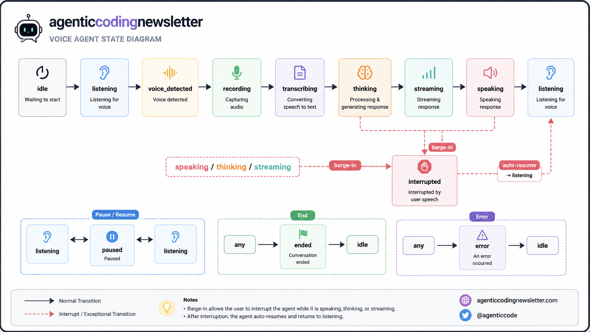
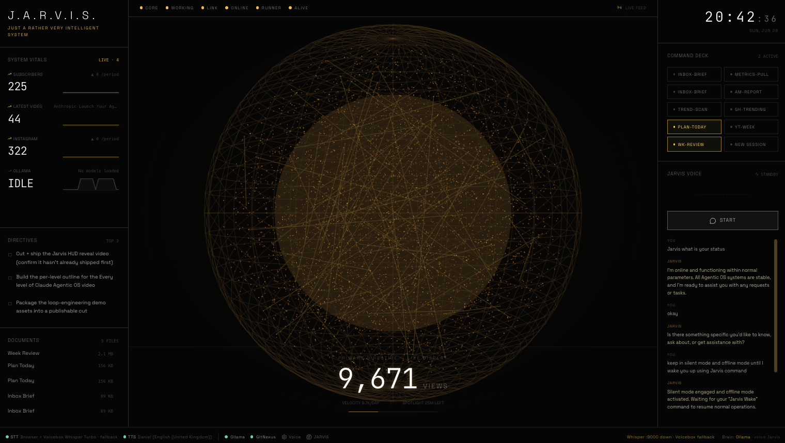
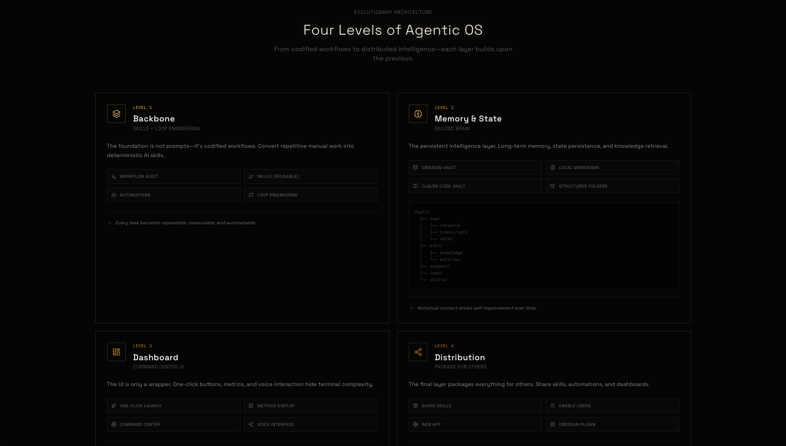
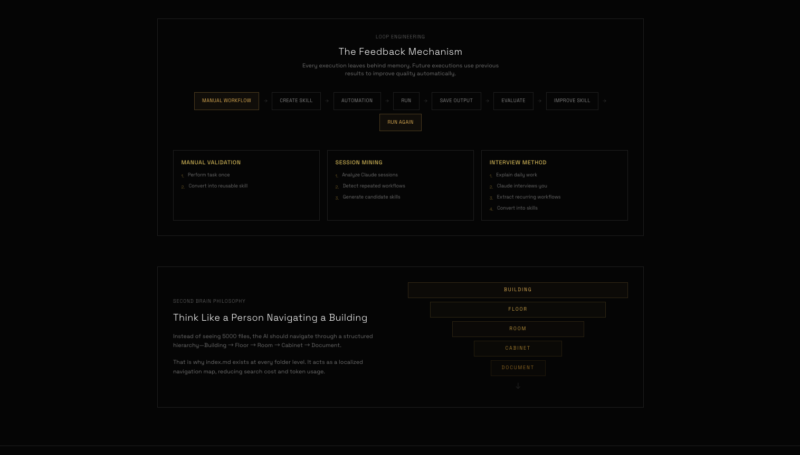

<a href="https://github.com/imdadareeph/agentic-os">
  
</a>

<br/>
<br/>

<div align="center">

# Agentic OS

> **A Local-First AI Operating System for Autonomous Agents**

<strong>
Local AI command center with JARVIS real-time voice conversation.
<br />
Whisper STT · Ollama brain · browser TTS · live vitals dashboard.
</strong>

<br />
<br />

[](https://react.dev/)
[](https://vite.dev/)
[](https://ollama.com/)
[](https://github.com/openai/whisper)
[](https://discord.com/invite/faJWzQfR)

</div>

<br/>

Agentic OS is a local-first, modular, event-driven AI operating system designed to orchestrate voice interaction, memory, autonomous agents, local LLMs, and extensible tools through a unified runtime.

Unlike traditional AI chat applications, Agentic OS is built around the concept of **AI as an operating system**, where the language model is only one component of a much larger architecture.

**Frontend app docs:** [app/README.md](app/README.md)

---

## Screenshots

<table>
  <tr>
    <td align="center">
      
      <br />
      <sub>Command deck, vitals, and voice session</sub>
    </td>
    <td align="center">
      
      <br />
      <sub>Voice pipeline &amp; service status</sub>
    </td>
  </tr>
  <tr>
    <td colspan="2" align="center">
      
      <br />
      <sub>Voice agent lifecycle — listen → transcribe → think → speak</sub>
    </td>
  </tr>
</table>

---

## Vision

Modern AI applications are mostly conversations.

Agentic OS is designed to become an intelligent runtime capable of:

* Voice conversations
* Long-term memory
* Tool orchestration
* Autonomous workflows
* Multi-agent collaboration
* Local AI execution
* Knowledge management
* Real-time observability

The conversation is only one interface into the system.

---

## Design Philosophy

### Local First

Everything should run locally whenever possible.

No cloud dependency is required for the core experience.

### AI Native

Every subsystem is designed with AI as the primary user.

Instead of adding AI into existing software, the operating system itself is AI-driven.

### Event Driven

Subsystems never directly depend on one another.

Everything communicates through runtime events.

```
Voice Engine

↓

Runtime Event Bus

↓

Memory Engine

↓

Planner

↓

Tool Engine

↓

LLM

↓

Response
```

### Modular

Every capability exists as an independent engine.

Examples:

* Voice Engine
* Memory Engine
* Planner Engine
* Search Engine
* Automation Engine
* Plugin Engine

### Observable

Every decision should be inspectable.

The runtime exposes:

* events
* state transitions
* memory retrieval
* tool execution
* latency
* health
* metrics

---

## Features

### Local AI

* Ollama integration
* Local LLM support
* Multiple model support
* Model routing
* Streaming responses

### Voice Conversation

* Browser microphone
* Whisper transcription
* Browser TTS
* Voice interruption (barge-in)
* Continuous conversation
* Push-to-talk
* Conversation mode

### Memory Engine

Multiple memory layers:

* Working Memory
* Conversation Memory
* Episodic Memory
* Semantic Memory
* Procedural Memory
* Knowledge Memory

Supports:

* long-term memory
* retrieval
* summarization
* embeddings
* knowledge graph

### Runtime

* Event Bus
* Engine Lifecycle
* Runtime State Machine
* Health Monitoring
* Observability

### Tool System

Pluggable tool architecture.

Examples:

* GitHub
* Docker
* Filesystem
* Browser
* Terminal
* PostgreSQL
* Neo4j
* Qdrant
* Email
* Calendar

### Mission Control

A real-time dashboard displaying:

* Runtime activity
* Voice status
* Memory retrieval
* Active tools
* System health
* AI reasoning pipeline
* Agent activity

---

## High-Level Architecture

```
                         Agentic OS

                    React Mission Control
                             │
                     REST + WebSocket
                             │
                     Runtime (Rust)
                             │
                    Internal Event Bus
                             │
      ┌───────────────┬───────────────┬───────────────┐
      │               │               │
 Voice Engine   Memory Engine   Planner Engine
      │               │               │
 Search Engine  Plugin Engine  Automation Engine
      │               │               │
      └───────────────┼───────────────┘
                      │
                Tool Registry
                      │
      GitHub • Docker • Filesystem • Browser
                      │
          Ollama • Whisper • Voicebox
                      │
        SQLite • PostgreSQL • Neo4j • Qdrant
```

---

## Runtime Engines

### Voice Engine

Responsible for:

* microphone
* voice activity detection
* speech recognition
* speech synthesis
* interruption
* conversation state

### Memory Engine

Responsible for:

* conversation memory
* episodic memory
* semantic memory
* procedural memory
* knowledge retrieval
* embeddings
* context building

### Planner Engine

Responsible for:

* intent detection
* task planning
* workflow generation
* execution planning

### Search Engine

Responsible for:

* semantic search
* keyword search
* graph traversal
* hybrid retrieval

### Plugin Engine

Responsible for:

* loading plugins
* capability registration
* permissions
* lifecycle

### Automation Engine

Responsible for:

* scheduled tasks
* background jobs
* workflows
* autonomous execution

---

## Technology Stack

### Frontend (current)

* React 19
* Vite 7
* TypeScript
* Scoped CSS with design tokens

### Backend (planned)

* Rust
* Axum
* Tokio

### AI

* Ollama
* Whisper
* Voicebox

### Storage

* SQLite
* PostgreSQL
* Qdrant
* Neo4j

### Communication

* REST API
* WebSocket
* Runtime Event Bus

---

## Repository Structure

```
Agentic OS/
├── app/                      # React + Vite Mission Control (JARVIS UI)
│   ├── src/                  # components, hooks, services, stores
│   ├── public/               # screens, voices, static assets
│   └── server/               # vitals API (Vite plugin)
├── docker-compose.voice.yml  # Whisper Docker service
├── jarvis-voice.wav          # reference voice sample (copy to app/public/voices/)
└── .cursor/aidocs/docs/      # architecture & design documentation
```

---

### Future architecture (planned)

```
src/
  runtime/
  engines/
    voice/
    memory/
    planner/
    automation/
    plugins/
  tools/
  ui/
    dashboard/
```

---

## Memory Model

Agentic OS implements multiple memory systems inspired by human cognition.

```
Working Memory

↓

Conversation Memory

↓

Episodic Memory

↓

Semantic Memory

↓

Procedural Memory

↓

Knowledge Memory
```

The LLM never owns memory.

The Memory Engine retrieves relevant context before every request.

---

## Voice Pipeline

```
User

↓

Voice Activity Detection

↓

Whisper

↓

Intent Detection

↓

Memory Retrieval

↓

Ollama

↓

Browser TTS

↓

User
```

Supports:

* interruption
* pause
* resume
* continuous conversation

---

## Event Flow

```
VOICE_STARTED

↓

TRANSCRIPTION_STARTED

↓

TRANSCRIPTION_COMPLETED

↓

MEMORY_RETRIEVAL

↓

LLM_STARTED

↓

TOKEN_STREAM

↓

LLM_COMPLETED

↓

TTS_STARTED

↓

VOICE_INTERRUPTED

↓

SESSION_COMPLETED
```

---

## Roadmap

### Phase 1

* Voice conversation
* Ollama integration
* Whisper
* Runtime
* Dashboard

### Phase 2

* Memory Engine
* Knowledge retrieval
* Session management
* Vector search

### Phase 3

* Plugin architecture
* Tool registry
* Automation
* Workflow engine

### Phase 4

* Multi-agent runtime
* Agent collaboration
* Background execution

### Phase 5

* AI Operating System
* Autonomous workspace
* Full Mission Control

---

## Quick start

```bash
cd app
pnpm install   # or npm install
npm run dev    # http://localhost:3000
```

### 1. Start Whisper (final transcription)

From the `app/` directory:

```bash
cd app
npm run voice:whisper   # Docker on port 9000 (uses ../docker-compose.voice.yml)
npm run voice:check     # verify
```

### 2. Start Ollama (JARVIS brain)

```bash
ollama serve
ollama pull llama3.2   # or your preferred model
```

### 3. Optional: Voicebox fallback

Run Voicebox on `127.0.0.1:17493` with Whisper + TTS loaded. Enable in **Voice Settings** (gear in status bar).

### 4. JARVIS voice sample

Place your `jarvis-voice.wav` at:

```
app/public/voices/jarvis-voice.wav
```

Preview it in Voice Settings. For cloned JARVIS TTS, create a Voicebox profile from this file and set TTS provider to Voicebox.

---

## Voice Settings

Click **Voice** (gear) in the status bar to configure:

* Conversation vs push-to-talk
* Turn silence timeout
* Whisper refine toggle
* STT/TTS providers
* Browser voice, rate, pitch
* Voicebox profile name
* Service health

Settings persist in browser localStorage.

---

## JARVIS Settings

Click **JARVIS** (brain icon) in the status bar to configure the LLM assistant:

* **System instructions** — editable persona; reset to default anytime
* **Short answers** — voice-friendly 1–2 sentence replies (default on)
* **Deep thinking** — Ollama `think` mode for reasoning models (e.g. deepseek-r1, qwen3)
* **Personality** — default, technical, casual, or executive briefing style
* **Formality** — neutral, formal, or warm colleague tone
* **Ollama model** — pick a model or auto-select the first available
* **Temperature** and **max tokens** — inference tuning
* **Conversation memory** — last N user+assistant turns sent to the model (default 4)
* **Inject vitals** — append live YouTube, Instagram, Ollama stats to the system prompt
* **Test prompt** — ask JARVIS inline without starting the mic

Settings persist in browser localStorage. **NEW SESSION** in the command deck clears transcript and memory only — not these settings.

---

## Environment

Copy `app/.env.example` to `app/.env` for build-time defaults. Runtime overrides live in Voice Settings.

---

## Scripts

| Command | Description |
|---------|-------------|
| `npm run dev` | Dev server with proxies (`/whisper`, `/voicebox`, `/ollama`) |
| `npm run build` | Production build |
| `npm run voice:whisper` | Start Docker Whisper on :9000 |
| `npm run voice:check` | Health check Whisper API |

---

## Browser

Use **Chrome or Edge** for live speech recognition. Safari/Firefox fall back to push-to-talk + Whisper only.

---

## Documentation

| Document | Description |
| -------- | ----------- |
| [app/README.md](app/README.md) | Frontend setup, voice & JARVIS settings |
| [Docs index](.cursor/aidocs/docs/README.md) | Internal documentation index |
| [ARCHITECTURE](.cursor/aidocs/docs/ARCHITECTURE.md) | System architecture |
| [DESIGN](.cursor/aidocs/docs/DESIGN.md) | UI/UX design system |
| [ROADMAP](.cursor/aidocs/docs/ROADMAP.md) | Development roadmap |
| [VOICE_INTERRUPT](.cursor/aidocs/docs/VOICE_INTERRUPT.md) | Interruptible voice conversation |
| [FRONTEND](.cursor/aidocs/docs/FRONTEND.md) | Frontend architecture |
| [PRD](.cursor/aidocs/docs/PRD.md) | Product requirements |

---

## Guiding Principle

> **Everything is an Engine.**

Each subsystem owns its domain.

No engine directly mutates another engine's state.

Communication happens through:

* Runtime
* Events
* APIs

This keeps the system modular, observable, testable, and extensible.

---

## Long-Term Goal

Agentic OS is not intended to become another chatbot.

The long-term objective is to build a **desktop AI operating system** where memory, reasoning, voice, tools, automation, knowledge, and autonomous agents work together through a unified runtime.

The language model is only one component.

The operating system is the product.

---

## Community

Join the Discord — [discord.com/invite/faJWzQfR](https://discord.com/invite/faJWzQfR)
